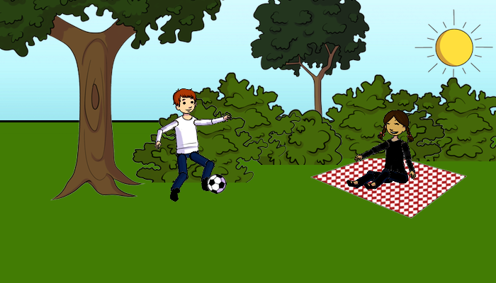
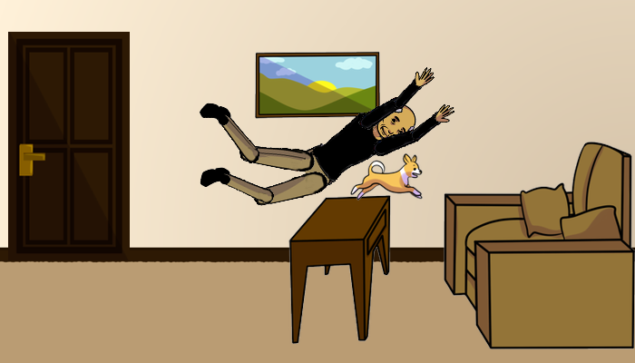
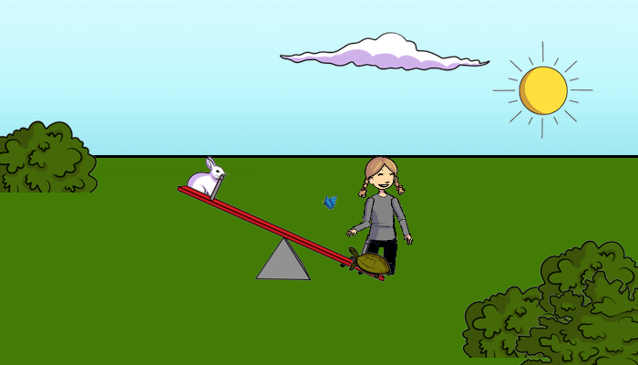

# Guidelines for manual image description

## Task

You will be given 41 clip art images. Your task is to describe what you see in each image.

You'll find a spreadsheet `descriptions_NAME.xsl`. Copy this file and rename it such that NAME is replaced with your last name. The first column of this file contains the filenames of the images to describe. The second column is where you'll write your description. The third column is left for you to write any comment regarding that specific image (see the [comment section](#comments)). 

The images are located in the folder `images/all`. 

## Writing the descriptions

Write **up to four** complete English-language sentences describing the scene you can see in the image. Always write **at least one** sentence. 

Try not to omit any details of the scene, even if you don't think they are relevant. In the following example, the trees and the sun are not necessarily important actors of the scene, but they should still be added to the description.

**Example of a good caption:** "A boy is playing soccer in front of two trees and a hedge. A girl is sitting on a picnic blanket laughing at the boy. The sun is shining."

**Example of a bad caption:** "A boy playing soccer. Near him, a girl on a picnic blanket. In the background, a sun."  *(This caption is bad because it is not written in complete sentences.)*

**Example of a bad caption:** "This is an outdoor park scene with a boy and a girl." *(This caption is bad because it does not provide enough details.)*

### Emotional aspects

Some of the images may evoke an emotional response, such as pity or laughter or confusion.  Whenever you perceive an image as evoking an emotional response, make sure to include in your description each item or person that contributes to that response. (Of course, you should try to also include other details of the scene, even if they do not contribute to the emotional response.)

Note that the caption should describe only the *content* of an image -- the persons and objects you can see -- and not external information like your own feelings or inferences.  It is OK to describe emotions expressed by people in the image, but not your own emotions on seeing the image.

Below are some further examples.

**Example of a good caption:** "A smiling old man and a dog are jumping over a table. They are jumping in the direction of a chair. A picture hangs behind the old man and the dog. There is a door next to the picture." 

**Example of a bad caption:** "A man and a dog are in a room with a table, a chair, a picture, and a door."  *(This caption is bad because it does not provide enough details on what makes the image funny or unusual.)*

**Example of a bad caption:** "A smiling old man and a dog are leaping over a table and into a chair. How strange! The room also contains a picture on the wall, and a door next to the picture."  *(This caption is bad because it explicitly states that the viewer finds the scene to be strange.)*

 

**Example of a good caption:** "A girl is laughing. In front of her, a rabbit and a turtle are playing on a see-saw, while a butterfly floats by. The sun is shining and a cloud is in the sky. Two bushes are on the left and right of the see-saw."

**Example of a bad caption:** "There is a girl who made me smile. Next to her, between two bushes, are a funny rabbit and a funny turtle on a see-saw. A butterfly flies above them. The sun is shining next to a cloud." *(This caption is bad because it describes the emotional effects of the girl, rabbit, and turtle on the viewer.)*

## Comments

During the annotation, if you have a problem annotating an image (for example, if you found it difficult or impossible to respect the description guidelines for that image), please mention this in the comment column of the annotation file. Examples: "too much to describe in four sentences", "don't know what object/animal this is", etc.
